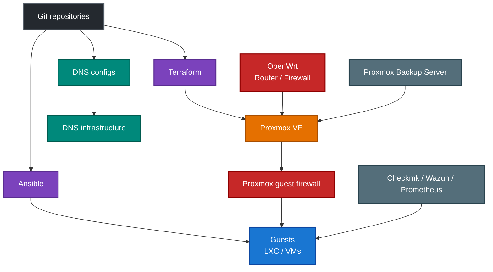

# homelab

A homelab focused on secure, automated, and reproducible infrastructure. Built to test and refine DevSecOps workflows, infrastructure-as-code, and system architecture best practices.

# Table of Contents

  - [Homelab Philosophy / Principles](#homelab-philosophy--principles)
  - [Provisioning & Stack](#provisioning--stack)
  - [Hardware](#hardware)
  - [Architecture](#architecture)
  - [🚀 Deployment Workflow](#-deployment-workflow)
  - [🛣️ Planned Enhancements](#-planned-enhancements)

## Homelab Philosophy / Principles

- 🔐 **DevSecOps-first** — secure-by-default, secrets managed outside repo (Vault)
- ⚙️ **Automate everything** — from provisioning to updates
- 🔁 **Reproducible environments** —  Ansible + Kickstart/Cloud-Init + Terraform 
- ☁️ **Multi-environment aware** — test/dev/staging/prod capability
- 🧪 **Sandbox for experimentation** — Kubernetes, CI/CD, PKI, monitoring, SIEM
- 📦 **Minimal manual state** — all managed via GitOps or scriptable IaC
- 📄 **Traditional "manual config"** - areas like DNS, VPN, and DHCP are treated as code: reproducible, tested, and version-controlled.

---

## Provisioning & Stack

| Layer           | Tools Used                              |
|-----------------|-----------------------------------------|
| Virtualisation  | Proxmox VE, VMware                      |
| Storage         | Ceph (bluestore, SSD-backed)            |
| Automation      | Ansible, Bash, Cron                     |
| Provisioning    | Kickstart / Cloud-Init                  |
| IaC             | Terraform (modular, multi-env)          |
| Secrets         | HashiCorp Vault                         |
| CI/CD           | GitHub Actions, Jenkins                 |
| Monitoring/SIEM | CheckMK, Prometheus, Wazuh              |
| Backup          | PBS, rsync, snapshot scripts            |

---

### 🧩 Critical Infrastructure Services

| Service          | Role                                 | Management Approach                                 |
|------------------|--------------------------------------|-----------------------------------------------------|
| DNS              | Internal name resolution             | Ansible-managed `bind9`, `dnsmasq` config           |
| DHCP             | IP allocation for internal subnets   | Static leases                                       |
| VPN              | Secure remote access (WireGuard)     | Config templated in Ansible, keys pre-provisioned   |
| PKI              | RootCA + IntermediateCA              | With automated OpenSSL scripts                      |
| NTP              | Internal time synchronisation        | Chrony config + upstream fallbacks                  |
| Syslog           | Central log aggregation              | Journald → Wazuh forwarding                         |
| Secrets          | Static + dynamic secrets management  | HashiCorp Vault with policy-based access            |
| PVE Firewall     | VM-level & cluster-wide firewalling  | Managed centrally via PVE UI and bridge-level rules |
| Backup           | Snapshot + file-level recovery       | PBS shots, Restic, and rsync                        |

> 💡 Most sysadmins don’t do GitOps for DNS, DHCP, or VPN — but this lab does. Core infrastructure is treated as **versioned infrastructure**, not mutable state.

---

### 🛡️ Firewall Strategy

- **Proxmox VE Firewall** is the _primary enforcement layer_ for guest isolation and service-specific access control.
- **OpenWRT** Zone-Based Firewall handles routing, perimeter security, VPN access and some inter-network policy.

**Key characteristics:**

- 🧱 **Datacenter-level policies**: Define default deny/allow rules across the cluster
- 🔒 **Guest-level isolation**: Service-specific rules per guest (e.g. allow SSH only from approved IPs)
- 🌐 **Bridge interface rules**: VLAN-based segmentation (e.g. restrict inter-VLAN traffic)
- 🖥️ **Hypervisor-edge enforcement**: Proxmox applies filtering outside the guest operating system, reducing reliance on controls that a compromised guest could modify.
- 📁 **Configuration as code**: Terraform manages guest firewall enablement, default policies and approved security-group attachments.

**Benefits:**

- ✅ Centralised management (UI or API)
- ✅ No dependency on external firewall VM
- ✅ True least-privilege enforcement before OS-level firewalls (enforced at the hypervisor layer)

This strategy enables **secure-by-default provisioning**: any newly created VM or container has a defined, scoped access profile enforced at the hypervisor layer.

> 🔐 All VM and interface firewall rules are version-controlled and reviewed alongside infrastructure code.

---

## Hardware

### 🖥️ Compute

| Name          | Model                   | CPU                    | RAM     | Storage / Drives                            | Role / Notes                                        |
|---------------|-------------------------|------------------------|---------|---------------------------------------------|----------------------------------------------------|
| pve2          | HP EliteDesk 800 G2 Mini| Intel i5-6600T (4C/4T) | 64 GiB  | Samsung 980 1 TB NVMe + WD Blue SA510 2 TB  | Proxmox VE node, Ceph OSD                          |
| pve3          | HP EliteDesk 800 G2 Mini| Intel i5-6600T (4C/4T) | 64 GiB  | Samsung 980 1 TB NVMe + WD Blue SA510 2 TB  | Proxmox VE node, Ceph OSD                          |
| pve4          | HP EliteDesk 800 G2 Mini| Intel i5-6600T (4C/4T) | 64 GiB  | Samsung 980 1 TB NVMe + WD Blue SA510 2 TB  | Proxmox VE node, Ceph OSD                          |
| pve6          | Dell OptiPlex 7440      | Intel i5-6600T (4C/4T) | 8 GiB   | 256 GB SSD (SATA)                           | Proxmox VE node (standalone)                      |
| Pi-KVM        | Raspberry Pi 4          | ARM Cortex-A72 (4C)    | 4 GiB   | MicroSD / USB Boot                          | Out-of-band KVM access (Geekworm KVM-A3)          |
| PKI Authority | Raspberry Pi 3          | ARM Cortex-A53 (4C)    | 1 GiB   | MicroSD                                     | Self-hosted Root CA / Intermediate CA (PKI host)  |

---

### 🔌 Networking Equipment

| Device           | Model             | Role                         | Notes                       |
|------------------|------------------|------------------------------|------------------------------|
| Switch 1         | Netgear GS108Tv3 | L2/L3 Managed Switch         | Primary access switch       |
| Switch 2         | Netgear GS108Tv3 | L2/L3 Managed Switch         | Secondary / test VLAN trunk |
| Router/Firewall  | GL.iNet AXT1800  | VPN Gateway, Wi-Fi, Routing | Primary router (OpenWRT)    |

---

### 🗄️ Storage Devices

| Device  | Model            | Drives                                                              | Notes                        |
|---------|------------------|---------------------------------------------------------------------|------------------------------|
| NAS1    | Asustor AS-606T  | <ul><li>Samsung EVO 850 250 GB SSD</li><li>2xSeagate 1 TB 7200 RPM HDD</li></ul>        | Archival, backup, media use  |

---

### 🪦 Retired Equipment

| Device       | Model                     | Role/Spec                                                  | Notes                                  |
|--------------|---------------------------|-------------------------------------------------------------|----------------------------------------|
| Node `pve1`  | Intel NUC 8        | Proxmox VE host (32 GiB RAM, Kingston DC1000B 480 GB SSD)   | Retired — original homelab node        |
| Node `pve5`  | HP T730 ThinClient         | Proxmox VE host Ran pfSense virtualised (Quad 2.5GbE)    | Retired in favour of GL.iNet AXT1800   |
| Core Switch  | Cisco 3750X               | Enterprise L3 switch                                        | Retired (too noisy/power hungry)       |
| Router       | TP-Link ER605             | WAN/Firewall Router                                         | Replaced with GL.iNet AXT1800          |

---

### Architecture

- ⚫ **Black** — Source control
- 🟣 **Purple** —  IaC - automation and configuration management
- 🟠 **Orange** — Virtualisation platform
- 🔴 **Red** — Network and security enforcement
- 🔵 **Blue** — Guests and workloads
- 🟢 **Teal** — Infrastructure services
- ⚪ **Grey** — Monitoring and backup

---

## 🚀 Deployment Workflow

---

## 🛣️ Planned Enhancements

---

