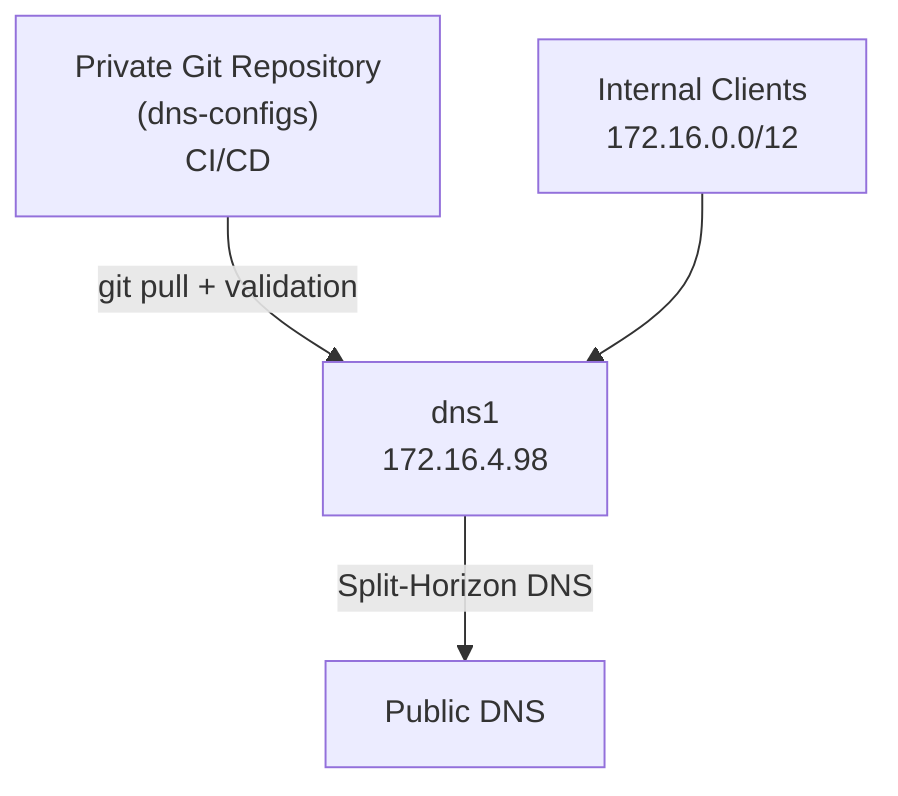

# DNS GitOps Evolution

  - [The Problem](#the-problem)
  - [🏠 Era 1 - Manual DNS](#era-1-manual-dns)
  - [🧩 Era 2 - dnsmasq](#era-2-dnsmasq)
  - [🔄 Era 3 - GitOps DNS](#era-3-gitops-dns)
  - [🚀 Era 4 - BIND9 Platform](#era-4-bind9-platform)
  - [🏗️ Era 5 - Dedicated DNS Repository](#era-5-dedicated-dns-repository)
  - [Current Architecture](#current-architecture)
  - [Current Journey](#current-journey)
  - [Future Roadmap](#future-roadmap)
  - [Conclusion](#conclusion)

---

## The Problem

DNS started as a simple requirement in the homelab: resolve internal hostnames without needing to remember IP addresses.

At the beginning, this was easy enough to manage manually. A few systems, a few static records, and a small number of services did not require anything sophisticated.

But as the homelab grew, DNS became more important.

The environment eventually needed:

- Multiple DNS servers
- Internal service discovery
- Consistent hostname management
- Split-horizon DNS
- ACME DNS challenge delegation
- A cleaner way to manage changes
- A rollback path when mistakes were made

At that point, DNS was no longer just a convenience.

It had become critical infrastructure.

The goal became simple:

> Treat DNS configuration like infrastructure code, not server-local state.

---

## 🏠 Era 1 - Manual DNS

The earliest version of the homelab used manually maintained DNS records through local `/etc/hosts` files.

This worked well when the environment was small.

It was simple, direct, and easy to understand.

However, it did not scale.

### Limitations

- Records had to be updated manually
- Each DNS server could drift from the others
- There was no central source of truth
- Rollback was manual (and near impossible)

This was fine for a small environment, but not for a growing infrastructure lab.

---

## 🧩 Era 2 - dnsmasq

The next step was to centralise DNS using `dnsmasq`.

This provided a lightweight and practical way to manage internal DNS for the homelab.

`dnsmasq` worked well for a long time because it was simple, reliable, and easy to integrate with DHCP and static host records.

### What dnsmasq improved

- Centralised DNS records
- Internal hostname resolution
- DHCP integration
- Simpler host management
- Better service discovery

This was a major improvement over manually maintained `/etc/hosts` files.

But eventually, the problem was no longer just DNS resolution.

The problem became configuration management.

---

## 🔄 Era 3 - GitOps DNS

Before migrating to BIND9, `dnsmasq` configuration was already being managed using GitOps principles.

At this stage, DNS records were stored in a private `dotfiles` repository and synchronised to the DNS server using a custom Bash deployment script.

The script checked the Git repository for changes, pulled the latest version, synchronised the DNS configuration, restarted `dnsmasq`, and recorded the last applied commit.

This was the first major shift from “DNS as server config” to “DNS as code”.

### What GitOps introduced

- Version control
- Change history
- Rollback capability
- A single source of truth
- Modular DNS record files
- Reduced configuration drift
- Repeatable deployment

This is an important part of the story:

> GitOps came before BIND9.

The operational maturity came from the workflow first, not the DNS software.

---

## 🚀 Era 4 - BIND9 Platform

As the homelab continued to grow, new DNS requirements appeared that were better suited to BIND9.

These included:

- Multiple DNS servers
- Authoritative DNS zones
- Split-horizon DNS
- RPZ (Response Policy Zones)
- ACME DNS challenge delegation
- Better modular zone files
- More advanced DNS policy control

`dnsmasq` had served the environment well, but BIND9 was a better fit for the next stage of the platform.

### Why BIND9

BIND9 provided a more complete DNS platform for managing internal and external-style DNS architecture.

It allowed the homelab to move towards:

- Authoritative DNS management
- Better validation tooling
- Cleaner zone separation
- More enterprise-style DNS design
- Managed DNS via FreeIPA (future)
- A foundation for future CI/CD validation

During the migration, `dnsmasq` and BIND9 were operated in parallel to reduce risk and allow staged validation.

---

## 🏗️ Era 5 - Dedicated DNS Repository

As part of the BIND9 migration, DNS configuration was extracted from the private `dotfiles` repository into a dedicated private repository:

`dns-configs`

This created a cleaner separation of concerns.

The `dotfiles` repository was no longer responsible for DNS platform configuration. DNS became its own infrastructure component with its own repository, lifecycle, and deployment process.

### Why split it out?

- DNS had grown beyond simple dotfile management
- DNS needed its own lifecycle
- Changes needed to be easier to audit
- Managing CI/CD (GitHub Actions) became simpler

This turned DNS from a supporting configuration into a standalone infrastructure platform.

---

## Current Architecture

The current design uses a private Git repository as the source of truth for DNS configuration.

DNS servers pull from the repository, validate configuration, and apply updates.

---

### Simple Architecture

> This is a simplified architecture showing only one DNS server.
>
> In practice, there are multiple DNS servers.

---




---

## Current Journey

The DNS platform evolved through the following stages:

```text
Manual DNS
    ↓
dnsmasq
    ↓
GitOps (dotfiles)
    ↓
BIND9
    ↓
GitOps (dns-configs)
    ↓
CI/CD Validation (WIP; Future)
```

---

## Future Roadmap

The next stage is focused on CI/CD validation and safer automated deployment.

Workflow improvements include:

- ✅ CI/CD validation pipelines
- 🔄 Automated `named-checkconf`
- 🔄 Automated `named-checkzone`
- 🔄 Pull request validation before deployment
- 🔄 Deployment approval workflows
- 🔄 Policy-as-code validation
- ✅ Automated promotion between test and production DNS servers

The long-term goal is for DNS changes to follow the same engineering standards as application or infrastructure changes.

---

## Conclusion

The biggest improvement was not simply moving from `dnsmasq` to BIND9.

**The biggest improvement was moving DNS into Git.**

**GitOps introduced version control, rollback, repeatability, and auditability before the DNS platform itself changed.**

BIND9 then provided the technical capabilities needed for a more advanced DNS architecture.

Together, these changes turned DNS from a manually managed service into a version-controlled infrastructure platform.