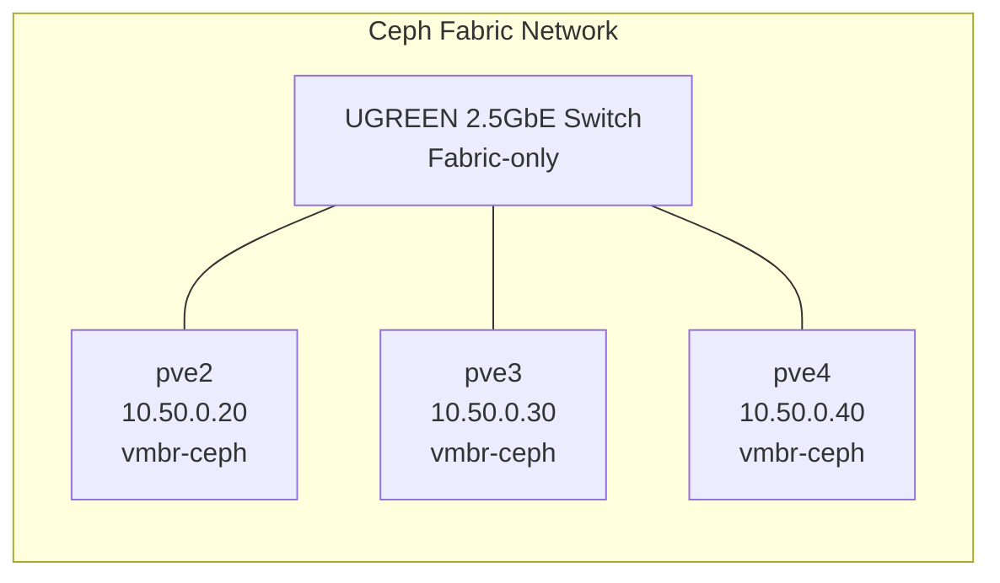

# Ceph Storage Fabric Upgrade

To isolate critical Ceph cluster traffic from the management plane and increase storage performance, a **dedicated Ceph fabric**.

## 🔧 Hardware

- **Switch**: [UGREEN 2.5Gbps x5 + 10Gbps SFP+ unmanaged switch](https://www.amazon.co.uk/dp/B0DXPDZPSQ)
- **Connectivity**: USB 2.5GbE adapters connected directly to each Proxmox node
- **Topology**: Flat Layer 2 (no gateway), direct-switch mesh between Ceph nodes

---

## 🌐 Ceph Fabric Subnet

| Node  | Fabric IP     | Interface           | Note                      |
|-------|---------------|---------------------|---------------------------|
| pve2  | `10.50.0.20`  | `Physical NIC` → `vmbr-ceph` | Fabric interface |
| pve3  | `10.50.0.30`  | `Physical NIC` → `vmbr-ceph` | Fabric interface |
| pve4  | `10.50.0.40`  | `Physical NIC` → `vmbr-ceph` | Fabric interface |

- **Subnet**: `10.50.0.0/24`
- **Routing**: No gateway (fabric-only)
- **Purpose**: Dedicated to Ceph **cluster traffic** (`OSD`, `MON`, `MGR` sync)

---

## 📄 Migration Documentation

A full migration guide detailing the network changes and Ceph reconfiguration is available in the [`docs`](https://github.com/safesploitOrg/docs/tree/main/best-practices/linux/storage/ceph/ceph-change-network) repo:

- Steps to rebind Ceph services to the new subnet
- Validation of OSD communication across fabric
- Interface changes (`/etc/network/interfaces`) for Proxmox nodes

---

## Ceph Fabric Diagram
